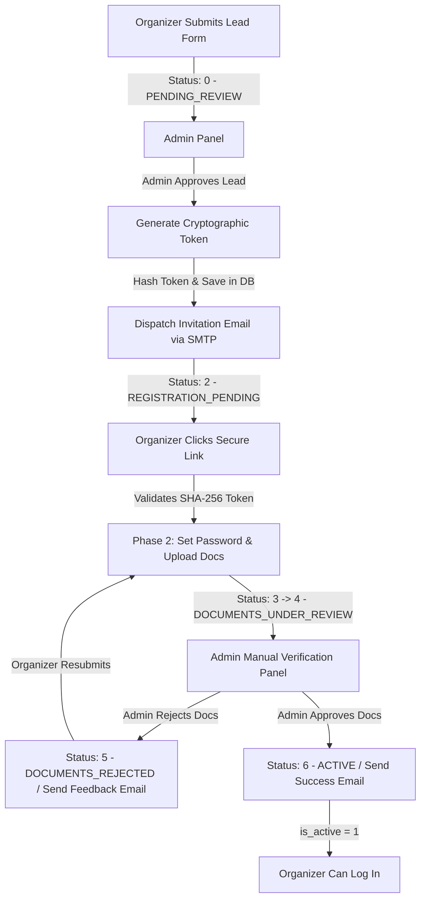

# Day 10: Organizer Onboarding Redesign & Emailing System ✉️🛡️

This documentation covers the **Day 10** implementation, which focused on transforming the organizer onboarding workflow into a secure, multi-stage process powered by a robust **database-driven Emailing System**, cryptographic token validation, and manual document audit workflows.

---

## 🏗️ 1. Architecture & Onboarding Workflow

To eliminate security risks (like pre-collecting user passwords) and establish a clear auditing trail, the onboarding flow has been split into two distinct phases connected by automated transactional email notifications:



### The 7-Stage Status Lifecycle:
* **`0` - PENDING_REVIEW**: Initial organizer application (lead) awaiting admin validation.
* **`1` - REJECTED**: Organizer's initial application is rejected.
* **`2` - REGISTRATION_PENDING**: Admin approved application; secure registration token sent to email.
* **`3` - REGISTRATION_COMPLETED**: Organizer completed Phase 2 form (set password).
* **`4` - DOCUMENTS_UNDER_REVIEW**: Organizer uploaded KYC documents (Aadhaar, PAN, Address Proof) for verification.
* **`5` - DOCUMENTS_REJECTED**: KYC documents audited and rejected by admin; resubmission needed.
* **`6` - ACTIVE**: Account fully verified and active (`is_active = 1`). Organizer can now access dashboard.

---

## 📧 2. Feature Highlight: The Emailing System

The core of Day 10 is the backend **Email Service**, designed to deliver real-time notifications for onboarding checkpoints.

### Key Capabilities:
1. **Dynamic Database Templates**: Email templates are stored inside the `email_templates` database table (created via Migration `014`). Subject lines and HTML layouts can be modified directly by admins in the DB without restarting or redeploying code.
2. **Nodemailer SMTP Integration**: Utilizes NodeMailer to establish secure SMTP connections using TLS. Configurable in `.env` (`SMTP_HOST`, `SMTP_PORT`, `SMTP_USER`, etc.).
3. **Simulation Fallback Mode**: If SMTP variables are missing from `.env`, the system automatically defaults to **Simulation/Fallback Mode**, logging dispatch events directly to standard terminal outputs. This ensures developers can run, test, and audit invitation flows locally without configuring SMTP servers.
4. **Email Template Editor UI**: A new administrative page (`/admin/email-templates`) allowing authorized staff to view, review variables (e.g. `{{name}}`, `{{inviteLink}}`, `{{reason}}`), and update templates on the fly.

---

## 🔒 3. Token & Security Architecture

1. **Entropy**: Server generates cryptographically secure 64-character tokens using `crypto.randomBytes(32).toString('hex')`.
2. **Defense-in-Depth**: To protect against database breaches, the raw token is sent only to the user's email. The database stores the SHA-256 hash of the token (`token_hash`).
3. **Expiration**: Stored in `organizer_invitations` table with a standard 72-hour lifespan (`expires_at`), protecting inactive invitations.
4. **Validation Endpoint**: The `GET /api/organizer-registration/validate?token=...` endpoint hashes the incoming token, checks it against the database, and validates expiry status before serving Phase 1 pre-fill data.

---

## 🖥️ 4. Frontend & Admin Audits

* **KYC Document Viewer**: Administrative dialog (`OrganizerDocsDialog.tsx`) displaying uploaded Aadhaar, PAN, and Address Proof files directly. Admins can audit document images side-by-side.
* **Status Controls**: Dynamic actions panel on `/admin/organizers` allowing admins to issue registrations, request document corrections (with customizable feedback strings), and trigger final activation.
* **Complete Onboarding Landings**: Beautiful `/organizer/register` secure page featuring password strength checks, profile confirmations, and multi-file drag-and-drop file uploaders.

---

## ⚙️ 5. Setup & Local Configuration

Follow these steps to run the complete stack locally:

### 1. Backend Configuration
1. Navigate to the backend directory:
   ```bash
   cd backend
   ```
2. Install dependencies:
   ```bash
   npm install
   ```
3. Copy `.env.example` to create your environment configuration:
   ```bash
   cp .env.example .env
   ```
4. Run the database migrations (creates `organizer_invitations` and `email_templates` tables):
   ```bash
   npm run migrate
   ```
5. *(Optional)* Configure SMTP variables in `.env` to send real emails. Otherwise, monitor the console terminal for simulation logs.
6. Start the backend:
   ```bash
   npm run dev
   ```

### 2. Frontend Configuration
1. Navigate to the frontend directory:
   ```bash
   cd frontend
   ```
2. Install dependencies:
   ```bash
   npm install
   ```
3. Start the dev server:
   ```bash
   npm run dev
   ```
