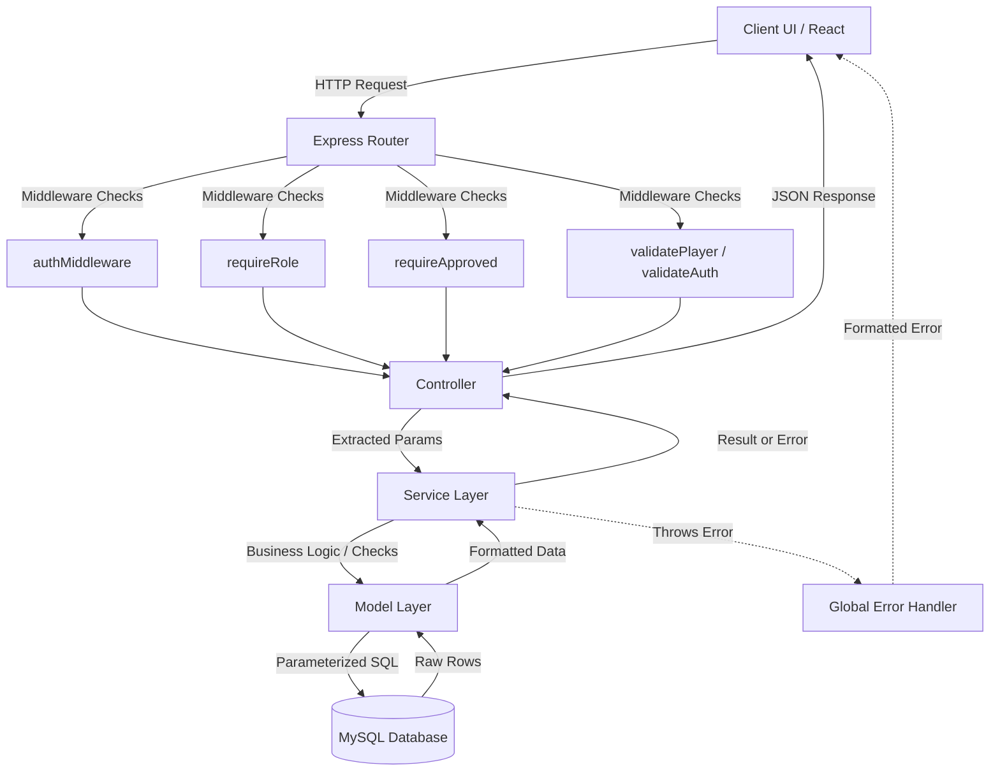

# Project Architecture

## Overview

The VNT Player Management System follows a strict **N-Tier (Layered) Architecture** on the backend and a **Component-Based Architecture** on the frontend. The system cleanly separates HTTP concerns from business logic and database execution, ensuring high maintainability and testability. The application is completely stateless, relying on JSON Web Tokens (JWT) for session management and standard REST principles for client-server communication.

The system currently includes: authentication, JWT-based authorization, player/team CRUD, file uploads (avatar, gallery, documents), background CSV bulk import (BullMQ queue), Role-Based Access Control (RBAC) with an Organizer approval workflow, location data (countries/states/cities), an Enrollments DataTable with server-side pagination and multi-filter support, a Notifications module, a Dashboard module with a cached master payload, and a Settings page.

> **Implemented:** The Organizer Onboarding workflow is redesigned and fully implemented. The flow features a multi-stage pipeline (Application → Pending Review → Approve/Reject → Registration Link → Documents Verified → Activated) with a cryptographically secure one-time invitation token, a database-driven email service, and separate document-verification and account activation steps.

---

## Layer Responsibilities

### Backend Layers
1. **Routes (`/src/routes`)**: Maps HTTP verbs and endpoints to controller functions. Applies route-level middleware (auth, validation, role checks).
2. **Controllers (`/src/controllers`)**: Entry point for the HTTP request lifecycle. Extracts parameters, delegates to Services, formats JSON responses.
3. **Services (`/src/services`)**: Core business logic, validation rules, and error throwing. Calls the Model layer to persist or retrieve data.
4. **Models (`/src/models`)**: Data access layer. Executes raw parameterized SQL against MySQL. Returns formatted results to Services.
5. **Middleware (`/src/middleware`)**: Intercepts requests before controllers:
   - `authMiddleware` – JWT token verification
   - `requirePermission('permission_name')` – Checks if the user's role has the required permission via DB lookup
   - `requireRole(role)` – Checks `req.user.role` against required role
   - `uploadMiddleware` – Multer-based file handling (avatars and documents)
   - `errorHandler` – Centralized error handler
   - `validatePlayer`, `validateAuth`, `validateTeam` – Schema-level input validation

### Frontend Layers
1. **Pages (`/src/pages`)**: Top-level views orchestrating layouts and URL state.
2. **Hooks (`/src/hooks`)**: Custom React Query hooks managing server state, fetching, caching, and background sync.
3. **Components (`/src/components`)**: Reusable UI elements (forms, tables, dialogs) receiving data via props or internal state.
4. **API Layer (`/src/api`)**: Axios instances and route definitions handling network requests and token injection via interceptors.

---

## Request Lifecycle

1. **Client Initiation**: Frontend triggers an HTTP request via Axios.
2. **Security & Rate Limiting**: Global middleware (`helmet`, `cors`, `rateLimit`) processes it first.
3. **Authentication Check**: `authMiddleware` validates the JWT in the `Authorization` header (protected routes only).
4. **Role Check**: `requireRole()` validates `req.user.role` (role-restricted routes only).
5. **Payload Validation**: Route-level middleware verifies the request body structure.
6. **Controller Processing**: Controller extracts validated data and calls the appropriate service method.
7. **Business Logic Execution**: Service processes business rules and throws custom errors on failure.
8. **Database Interaction**: Model executes parameterized SQL and returns raw rows.
9. **Response Formatting**: Controller sends a structured JSON response.
10. **Error Interception**: Global Error Handler intercepts any thrown error and formats a safe JSON response.

---

## RBAC Architecture

### Roles
| Role | Description |
|------|-------------|
| `admin` | Full system access. Can approve/reject organizers, verify documents, and activate accounts. |
| `organizer` | Can manage players/teams. Must be approved and activated by admin first. |
| `user` | Default role. Basic read access. |

### Approval Status Lifecycle
| Value | Code Name | Meaning |
|-------|-----------|---------|
| `0` | `PENDING_REVIEW` | Initial lead application awaiting admin review |
| `1` | `REJECTED` | Lead application or KYC documents rejected by admin |
| `2` | `REGISTRATION_PENDING` | Approved by admin; registration link sent via email |
| `3` | `REGISTRATION_COMPLETED` | Full registration & KYC submitted by organizer |
| `4` | `DOCUMENTS_VERIFIED` | KYC documents verified and approved by admin |
| `5` | `ACTIVE` | Organizer account fully activated (`is_active = 1`) |

The status flow is strictly forward and each transition is driven by an explicit admin action or organizer action.

### Middleware Chains
```
Organizer routes: Request → authMiddleware → requireRole('Organizer') → Controller
Admin routes:     Request → authMiddleware → requirePermission('manage_organizers') → Controller
```

---

## Authentication & Authorization Flow

### Login
1. Client submits credentials to `POST /api/auth/login`.
2. `authService` retrieves the user by email.
3. `bcrypt.compare()` verifies the password.
4. If the user is an organizer, checks that `approval_status === 5` (ACTIVE) and `is_active === 1` in the `organizers` table. Otherwise, returns `403 Forbidden` with the current status message.
5. If valid, signs and returns a JWT containing `{ id, email, role }`.

### Organizer Signup Lifecycle
The onboarding flow decouples application submission from user credential creation:
1. **Application Step**: Organizer submits Phase 1 application form (name, org, email, phone, state, city) at `/apply-organizer` or `/signup-organizer`. No password or KYC docs are collected yet. The record is saved as `approval_status = 0` (PENDING_REVIEW) in the `organizers` table.
2. **Admin Review (Approving lead)**: Admin views application and approves. The system generates a cryptographically secure, one-time invitation token (`crypto.randomBytes(32)`), stores its SHA-256 hash in the `organizer_invitations` table with a 72-hour expiration, sets the status to `2` (REGISTRATION_PENDING), and emails the secure link (`/organizer/register?token=<token>`) to the organizer.
3. **Registration Step**: Organizer clicks the email link, validating the token against the database. Organizer sets their password and uploads KYC documents. The token is marked consumed (`used_at = NOW()`), and the organizer record is updated with the password and document paths, setting status to `3` (REGISTRATION_COMPLETED).
4. **Document Verification**: Admin reviews submitted KYC documents and clicks "View & Verify Docs", verifying documents and setting status to `4` (DOCUMENTS_VERIFIED).
5. **Activation**: Admin activates the organizer account. A database transaction creates the corresponding user in the `users` table and sets the organizer record to `is_active = 1` and `approval_status = 5` (ACTIVE). An email notification is sent to the organizer, enabling them to log in.

### Admin Approval Lifecycle Flow
1. `GET /api/admin/organizers` – lists all organizers and their onboarding statuses.
2. `PATCH /api/admin/organizers/:id/approve` – approves lead application, generating a token and emailing the registration link (status 2).
3. `PATCH /api/admin/organizers/:id/reject` – rejects application or KYC with reason and sends a rejection email (status 1).
4. `PATCH /api/admin/organizers/:id/verify-documents` – verifies uploaded KYC documents (status 4).
5. `PATCH /api/admin/organizers/:id/activate` – performs atomic transaction creating `users` row and activating the account (status 5, `is_active = 1`).

---

## File Upload Flow

### Player Uploads
- **Avatar**: Single image → `/uploads/players/avatar/`
- **Gallery**: Up to 5 images → `/uploads/players/gallery/`
- Constraints: Max 2MB per file, `.jpg`/`.png` only.
- Storage: Relative file path stored in DB.

### Organizer Document Uploads
- **Documents**: Multiple files → `/uploads/organizers/documents/`
- Constraints: `.jpg`, `.png`, `.pdf`; max 5MB per file.
- Storage: Relative file paths stored in `organizers.documents` (JSON column).

---

## Enrollments Module Architecture

### Overview
The Enrollments module is a read-heavy data management feature built around **server-side pagination**, **multi-dimensional filtering**, and a **flag-based TINYINT enum** pattern for `status`, `invite_type`, and `role` columns.

### Database Schema – `enrollments`
```sql
CREATE TABLE enrollments (
  id          INT AUTO_INCREMENT PRIMARY KEY,
  name        VARCHAR(255) NOT NULL,
  phone       VARCHAR(20)  NOT NULL,
  team_id     INT          NOT NULL,
  status      TINYINT      NOT NULL DEFAULT 0,  -- 0=unpaid, 1=paid, 2=free
  invite_type TINYINT      NOT NULL DEFAULT 0,  -- 0=non-invited, 1=invited
  role        TINYINT      NOT NULL,             -- 1=batsman, 2=bowler, 3=wicketkeeper, 4=allrounder
  enrolled_at TIMESTAMP    DEFAULT CURRENT_TIMESTAMP,
  FOREIGN KEY (team_id) REFERENCES teams(id) ON DELETE CASCADE
);
```

### Flag Enum Contract (Backend ↔ Frontend)
| Column      | Value | Label        |
|-------------|-------|--------------|
| status      | 0     | Unpaid       |
| status      | 1     | Paid         |
| status      | 2     | Free         |
| invite_type | 0     | Non-Invited  |
| invite_type | 1     | Invited      |
| role        | 1     | Batsman      |
| role        | 2     | Bowler       |
| role        | 3     | Wicketkeeper |
| role        | 4     | All-rounder  |

### API Contract – `GET /api/enrollments`
**Query Parameters:**
- `page` (default: 1), `limit` (default: 50)
- `search` – partial match on `name` or `phone`
- `status`, `invite_type`, `role` – TINYINT filter values
- `team_id` – FK filter

**Response:**
```json
{
  "success": true,
  "data": [...],
  "pagination": { "page": 1, "limit": 50, "total": 1000, "totalPages": 20 }
}
```

### Dynamic SQL Filter Pattern
```javascript
const conditions = [], params = [];
if (search)                    { conditions.push('(e.name LIKE ? OR e.phone LIKE ?)'); params.push(`%${search}%`, `%${search}%`); }
if (status !== undefined)      { conditions.push('e.status = ?');      params.push(status); }
if (invite_type !== undefined) { conditions.push('e.invite_type = ?'); params.push(invite_type); }
if (role !== undefined)        { conditions.push('e.role = ?');        params.push(role); }
if (team_id)                   { conditions.push('e.team_id = ?');     params.push(team_id); }
const whereClause = conditions.length ? 'WHERE ' + conditions.join(' AND ') : '';
```

### Backend Layer Responsibilities
- **Route** (`enrollmentRoutes.js`): Binds `GET /` to controller. Public route.
- **Controller** (`enrollmentController.js`): Extracts `req.query`, calls service, returns JSON.
- **Service** (`enrollmentService.js`): Sanitizes/validates params, delegates to model.
- **Model** (`enrollmentModel.js`): Builds dynamic WHERE clause, runs `COUNT(*)` then paginated `SELECT ... LEFT JOIN teams`.

### Frontend Layer Responsibilities
- **Page** (`EnrollmentsPage.tsx`): Manages URL search params for all filter states.
- **Hook** (`useEnrollments.ts`): React Query hook syncing URL params to API call; includes CSV export utility.
- **API** (`enrollmentApi.ts`): Axios `GET /api/enrollments` with URLSearchParams.
- **Components**: `EnrollmentsTable.tsx`, `EnrollmentViewDialog.tsx`, `EnrollmentEditDialog.tsx`, `EnrollmentDeleteDialog.tsx`.

### Server-Side Pagination Strategy
- All filter and page state lives in the URL (`?page=1&limit=50&status=1&role=2`).
- React Query key includes all params — any change triggers a fresh fetch.
- `COUNT(*)` + `LIMIT/OFFSET` pattern — never fetches all rows at once.

### Flag-to-Label Resolution (Frontend)
Constants defined in `src/utils/enrollmentFlags.ts` — single source of truth:
```typescript
export const STATUS_LABELS: Record<number, string> = { 0: 'Unpaid', 1: 'Paid', 2: 'Free' };
export const INVITE_LABELS: Record<number, string> = { 0: 'Non-Invited', 1: 'Invited' };
export const ROLE_LABELS:   Record<number, string> = { 1: 'Batsman', 2: 'Bowler', 3: 'Wicketkeeper', 4: 'All-rounder' };
```

---

## MVP Ranking & Leaderboard Architecture

### Overview
A production-level Leaderboard system to rank MVP players. It is designed to handle high data volume (e.g., 10,000+ players) by separating match-by-match performance logs from the final calculated leaderboard and serving results rapidly through a Redis cache.

### Database Schema
1. **`mvp_performance_logs`**: Stores every match performance separately.
   - Fields: `id`, `player_id`, `batting_points`, `bowling_points`, `fielding_points`, `is_mft`, `created_at`
2. **`mvp_players`**: The final aggregated ranking table.
   - Fields: `id`, `player_id`, `player_full_name`, `total_points`, `rank_position`, `is_mft`
3. **`mvp_sync_logs`**: Audit trail for background sync operations.
   - Fields: `id`, `total_players`, `started_at`, `completed_at`, `status`

### Auto Sync Workflow (Cron)
- A **`node-cron`** job runs automatically (e.g., `* * * * *` for every 1 minute).
- **Execution**: 
  1. Purges old Redis cache (`redis.del('mvp:leaderboard')`).
  2. Incremental or optimized aggregation from `mvp_performance_logs`.
  3. Updates or inserts records into `mvp_players`.
  4. Ranks players by `total_points DESC`.
  5. Stores the final leaderboard in Redis (Key: `mvp:leaderboard`) with a short TTL (60-120s).
  6. Logs execution (start, end, success/fail) in `mvp_sync_logs`.
- **Fault Tolerance**: If the sync logic fails, the error is logged without crashing the main application server.

### API Endpoints
- `GET /api/mvp/leaderboard` – Fetches the ranking (Checks Redis first, falls back to DB).
- `GET /api/mvp/last-sync` – Returns the last successful run time and total players processed.

---

## Notifications System Architecture

### Overview
The Notifications system allows admins to push messages to all users or specific roles. It retrieves notifications filtered by the requester's role.

### Backend Layer Responsibilities
- **Controller** (`notificationController.js`): Directly manages the creation, deletion, and fetching of notifications without a service layer since logic is relatively light.
- **Model** (`notificationModel.js`): Inserts and retrieves notifications from the DB, applying `LEFT JOIN` on the `roles` table.

---

## Dashboard Architecture

### Overview
A cached master payload architecture for providing the main overview statistics to the frontend, designed to minimize DB load on page refreshes.

### Backend Layer Responsibilities
- **Service** (`dashboardService.js`): Uses a Master Payload pattern fetching data across parallel Promises.
- **Cache Strategy**: Employs a Redis Cache-Aside pattern (key: `dashboard:master_payload_v3`) with a 300-second TTL to ensure minimal query execution during heavy traffic.

---

## Frontend → Backend Flow

The frontend communicates exclusively via RESTful JSON APIs using Axios.
- **Interceptors**: Request interceptor attaches the JWT from `localStorage`. Response interceptor catches `401` and forces logout.
- **Server State**: React Query handles fetching, caching, and background sync.

---

## Backend → Database Flow

- MySQL via `mysql2` connection pool (`config/db.js`). No ORM.
- **Parameterization**: Every dynamic value injected using `?` placeholders.
- **Relational Joins**: `LEFT JOIN` for optional related data (teams, locations).
- **Pagination**: Separate `COUNT(*)` query → then `LIMIT`/`OFFSET`.

---

## Error Handling Flow

1. Controllers wrap execution in `try/catch` and call `next(error)` on failure.
2. Services throw custom `Error` objects with an attached `.status` code.
3. Global Error Handler (`errorHandler.js`) intercepts all errors and formats a safe JSON response.

---

## Dependency Graph

```
[Frontend (React/Vite/TypeScript)]
  ├── React Router (Navigation + Protected Routes)
  ├── React Query (Server State Cache)
  └── Axios (HTTP Client)
       └── Interceptors (Auth Injection / 401 Redirect)

[Backend (Express)]
  ├── Helmet & CORS (Security)
  ├── Express Rate Limit (DDoS Protection)
  ├── jsonwebtoken (Auth + Role Payload + Invitation Tokens)
  ├── bcrypt (Password Hashing)
  ├── multer (File Upload Handling)
  ├── nodemailer (Email Service)
  ├── bullmq + ioredis (Background Job Queue)
  ├── mysql2 (Database Pool)
  ├── redis (Leaderboard & Dashboard Caching)
  └── node-cron (Automated Background Syncs)
```

---

## Folder Responsibilities

| Path | Responsibility |
|------|---------------|
| `backend/src/config/` | DB pool, Redis connection |
| `backend/src/controllers/` | HTTP request/response orchestration |
| `backend/src/middleware/` | Auth, Role, Approval, Upload, Validation, Error Handling |
| `backend/src/models/` | Parameterized SQL execution |
| `backend/src/routes/` | Endpoint definitions and middleware binding |
| `backend/src/services/` | Business logic and rule enforcement |
| `backend/src/jobs/` | Cron jobs and scheduled tasks |
| `backend/src/queues/` | Bull queue definitions |
| `backend/src/workers/` | Background job processors |
| `backend/src/utils/` | Helper utilities |
| `frontend/src/api/` | Network request definitions and Axios config |
| `frontend/src/services/` | Frontend-specific business logic services |
| `frontend/src/components/` | Reusable UI elements |
| `frontend/src/hooks/` | Data fetching and state logic |
| `frontend/src/pages/` | View orchestration and URL syncing |
| `frontend/src/utils/` | Pure helper functions and flag constants |

---

## Module Interaction Diagram



---

## Architectural Observations

### Design Patterns
1. **Dependency Injection (Light)**: Connection pools and request objects passed downwards.
2. **Singleton**: `mysql2` connection pool acts as a singleton.
3. **Decorator (Middleware)**: Express middleware dynamically adds auth, validation, and role enforcement to routes.
4. **Strategy Pattern**: `requireRole()` accepts a role string — reusable for any role-based check.

### Strengths
- **Separation of Concerns**: HTTP logic entirely decoupled from business logic.
- **Statelessness**: JWT usage ensures no session memory consumed.
- **Security**: Centralized error handling, parameterized queries, role middleware.
- **Extensibility**: RBAC middleware composable freely without coupling.

### Known Weaknesses
- **No Refresh Tokens**: JWTs are long-lived with no rotation mechanism.
- **No DTOs**: Service layer receives raw `req.body` objects.
- **Model Bloat Risk**: Dynamic SQL generation complexity grows with more filters.
- **No Test Architecture**: No unit or integration testing infrastructure.

### Future Refactoring Opportunities
1. **Schema Validation**: Adopt `Joi` or `Zod` for request body validation.
2. **Query Builder**: Use `Knex.js` to manage dynamic WHERE clauses cleanly.
3. **Refresh Tokens**: Add JWT refresh token rotation.
4. **TypeScript (Backend)**: Migrate backend to TypeScript for interface enforcement.
