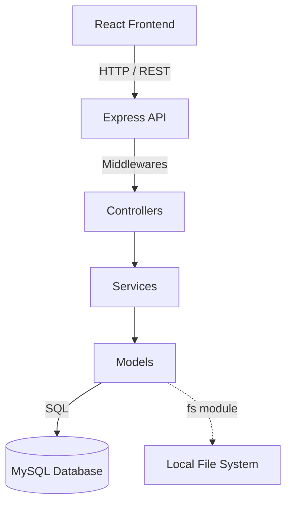
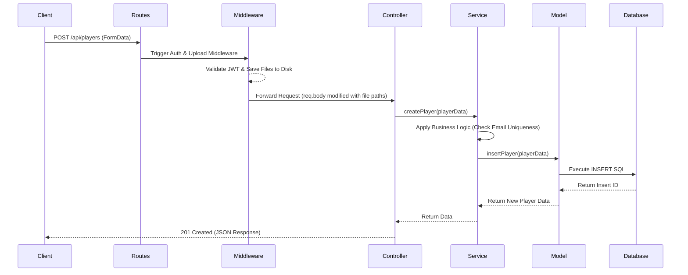

# Project Architecture

## Project Architecture Overview
The project is designed as a modern web application consisting of a React-based Single Page Application (SPA) on the frontend and a RESTful Node.js (Express) server on the backend. The architecture follows a strict Client-Server model. The backend is organized using a Layered Architecture (often referred to as an MVC-like or N-Tier architecture), ensuring separation of concerns by isolating routing, business logic, and database access. The frontend utilizes a component-based architecture powered by React, managing global server state via React Query and local UI state via React Hooks.

## Layer Responsibilities

### Backend Layers
- **Routes Layer (`/routes`)**: Responsible for defining API endpoints and mapping HTTP methods (GET, POST, PUT, DELETE) to specific controller functions. It also applies route-level middleware (e.g., authentication, file uploads, request validation).
- **Controller Layer (`/controllers`)**: Acts as the orchestrator between incoming HTTP requests and the business logic layer. Controllers extract data from request bodies, parameters, and query strings, invoke the appropriate service, and return standard JSON responses or HTTP errors.
- **Service Layer (`/services`)**: Contains the core business rules of the application. Services handle complex operations, data formatting, and cross-model interactions (e.g., checking if an email is already taken before saving a player).
- **Model/Repository Layer (`/models`)**: Dedicated to database interactions. This layer encapsulates all raw SQL queries using the `mysql2` promise pool, abstracting the database engine away from the business logic.
- **Middleware Layer (`/middleware`)**: Intercepts requests before they reach the controller. Used for cross-cutting concerns such as JWT validation (`authMiddleware`), input validation (`validatePlayer`), error handling, and file parsing (`uploadMiddleware`).

### Frontend Layers
- **API/Service Layer (`/api`, `/services`)**: Manages external communication. Configures Axios instances (e.g., attaching auth tokens) and defines functions mapped to backend endpoints.
- **State Management Layer (`/hooks`)**: Custom React Query hooks (e.g., `usePlayers`, `useMutations`) manage caching, background fetching, and synchronization of server data with the UI.
- **Component Layer (`/components`)**: Composed of domain-specific components (e.g., `PlayerCard`, `PlayerForm`) and generic reusable UI primitives (e.g., `Button`, `Input`).
- **Page Layer (`/pages`)**: High-level components acting as route boundaries. They compose various smaller components to represent full views (e.g., `PlayersPage`, `LoginPage`).

## Request Lifecycle
1. **Client Request**: The frontend application makes an HTTP request via Axios.
2. **Security & Parsing**: The backend receives the request. Middleware like `helmet` (security headers), `rateLimit` (throttling), `cors`, and `express.json()` process the raw request.
3. **Route Matching**: Express router matches the URL path and HTTP method.
4. **Pre-processing (Middleware)**: 
   - Authentication middleware validates the JWT.
   - Upload middleware processes multipart form data (if applicable).
   - Validation middleware validates the request body.
5. **Controller**: Extracts validated data and passes it to the Service layer.
6. **Service**: Applies business logic.
7. **Model**: Executes SQL queries against the MySQL database.
8. **Response**: The Controller wraps the Service's result in a standard JSON format and sends it back to the client.

## Frontend → Backend Flow
- **Transport**: JSON over HTTP (REST).
- **Client**: Axios is used to perform async requests.
- **Interceptors**: An Axios interceptor automatically reads the JWT from `localStorage` and appends it to the `Authorization` header as a Bearer token.
- **State Integration**: React Query mutations trigger API calls. On success, React Query invalidates cached queries, automatically triggering a refetch and updating the UI without manual state synchronization.

## Backend → Database Flow
- **Connection**: Managed via a connection pool (`config/db.js`) using `mysql2`.
- **Querying**: The Model layer executes parameterized raw SQL queries to prevent SQL injection.
- **Result Parsing**: Database rows are returned as arrays of objects, which are passed back up to the Service layer.

## Authentication Flow
1. **Login**: Client sends email/password to `/api/auth/login`.
2. **Verification**: Backend fetches the user by email from the database and compares the hashed password using `bcrypt`.
3. **Token Generation**: If valid, a JSON Web Token (JWT) is signed containing the user ID and email, expiring in 24 hours.
4. **Storage**: The token is sent to the client and stored in `localStorage`.
5. **Subsequent Requests**: The client attaches the token to the `Authorization` header. The backend `authMiddleware` verifies the token signature using the secret key before allowing access to protected routes.

## Authorization Flow
Currently, the system employs a flat authorization model. If a user presents a valid JWT, they are granted access to all protected endpoints (creating teams, modifying any player). There is no granular Role-Based Access Control (RBAC) implemented in this version, meaning all authenticated users possess equal administrative privileges.

## Validation Flow
1. **Client-Side**: React Hook Form paired with Zod schemas prevents invalid data from being submitted to the backend, providing immediate UX feedback.
2. **Server-Side**: Express middleware intercepts the request body. If the data fails the backend validation schema, a `400 Bad Request` is returned immediately, preventing the controller from executing.
3. **Database Constraints**: The database enforces schema-level constraints (e.g., Foreign Keys, unique constraints) as a final safeguard.

## File Upload Flow
1. **Client**: User selects images. The frontend constructs a `FormData` object instead of a standard JSON body.
2. **Backend Interception**: The `uploadMiddleware.js` (using Multer) parses the multipart request.
3. **Storage**: Files are saved directly to the server's local disk in `/uploads/players/avatar` and `/uploads/players/gallery`.
4. **Database Reference**: The file paths (e.g., strings or stringified JSON arrays) are injected into the `req.body` and subsequently saved to the database.
5. **Cleanup**: If a player is updated or deleted, `fileUtils.js` triggers `fs.unlink` to remove orphaned files from the disk.

## Error Handling Flow
- **Business Exceptions**: Services throw custom Error objects (e.g., `const error = new Error("Not found"); error.status = 404; throw error;`).
- **Global Catcher**: An Express global error handling middleware (`errorHandler.js`) sits at the end of the middleware stack. It catches all synchronous and asynchronous errors, formats them into a predictable JSON structure `{ success: false, message: "..." }`, and responds with the appropriate HTTP status code, preventing the server from crashing and obscuring stack traces from the client.

## Configuration Flow
Environment variables dictate environment-specific behaviors. The `dotenv` package loads variables from a `.env` file into `process.env` at runtime startup. This abstracts secrets (JWT keys, DB credentials) away from the source code.

## Dependency Graph

## Folder Responsibilities
- **`/backend/src`**: The root of server application logic.
  - **`/controllers`**: HTTP orchestrators.
  - **`/services`**: Business logic engines.
  - **`/models`**: Data access layer.
  - **`/routes`**: URL routing tables.
  - **`/middleware`**: Request interceptors.
  - **`/utils`**: Pure functions and cross-cutting helpers.
- **`/frontend/src`**: The root of the UI application.
  - **`/components`**: Reusable view blocks.
  - **`/pages`**: View aggregators mapped to routes.
  - **`/hooks`**: Data fetching and local logic abstraction.
  - **`/api`**: Network communication abstraction.

## Module Interaction Diagram

## Reusable Utilities
- **Backend**: `fileUtils.js` provides generic file deletion capabilities mapped to absolute paths. `response.js` standardizes success payload structures.
- **Frontend**: The `ui` component folder provides headless, highly reusable styling primitives utilizing `tailwind-merge` (`cn.ts`) to allow seamless class overriding without conflicts.

## Shared Abstractions
- Both frontend and backend share an implicit understanding of the data schema. While not strictly typed across the network via something like tRPC, the TypeScript interfaces in `frontend/src/types` perfectly mirror the SQL schema representations returned by the backend models.

## Design Patterns Being Used
- **Layered Architecture / N-Tier**: Strict separation between networking, logic, and data access.
- **Dependency Injection (Conceptual)**: While true DI frameworks are not used, Controllers inject request data into Services, keeping Services agnostic of HTTP concepts.
- **Singleton Pattern**: The database connection pool (`config/db.js`) acts as a singleton, utilized globally across models.
- **Observer / Pub-Sub (Frontend)**: React Query employs a pub-sub model under the hood to synchronize UI state across multiple components when cached data changes.

---

# Architectural Observations

## Architectural Strengths
- **Separation of Concerns**: The backend layering makes the codebase highly testable and maintainable. Services can be unit tested without mocking Express request/response objects.
- **Predictable Data Flow**: Unidirectional data flow in React paired with strict Layered boundaries in the backend makes debugging straightforward.
- **Modern Frontend Stack**: Utilizing React Query and Vite ensures excellent developer experience and highly optimized, cache-driven frontend performance.
- **Security Posture**: Sensible defaults are used (Helmet, Rate Limiting, bcrypt, parameterized SQL) to protect against the most common OWASP vulnerabilities.

## Architectural Weaknesses
- **Stateful File Storage**: Storing files on the local filesystem tightly couples the application state to the specific server instance it runs on.
- **Lack of ORM**: While raw SQL is fast, managing complex joins, migrations, and schema changes natively requires significant boilerplate and lacks type safety compared to modern ORMs (e.g., Prisma).
- **Coarse Authorization**: The lack of granular permissions limits the application's ability to scale into a multi-tenant or multi-role system safely.

## Potential Future Refactoring Opportunities
- **Decouple File Storage**: Migrate local `multer` storage to an abstract storage interface backed by AWS S3 or Google Cloud Storage to enable horizontal backend scaling.
- **Implement RBAC**: Introduce Role-Based Access Control to support 'Admin' vs 'User' workflows, separating read/write boundaries natively in the Service layer.
- **Introduce an ORM/Query Builder**: Transition from raw `mysql2` strings to Prisma or Knex.js. This will drastically improve schema maintainability and provide automatic type generation for the frontend.
- **Monorepo Structure**: Consolidate the frontend and backend into a single monorepo (e.g., using Turborepo) to share Zod validation schemas and TypeScript types directly between environments.
