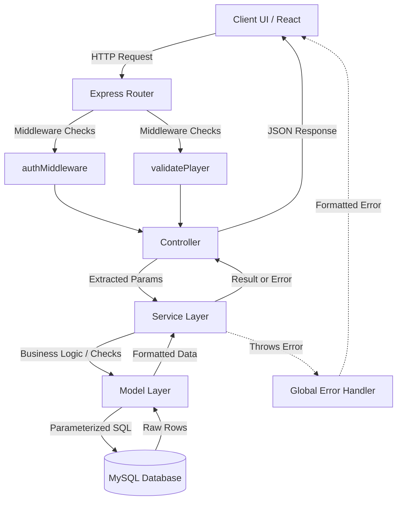

# Project Architecture

## Project Architecture Overview

The Player Management System follows a strict **N-Tier (Layered) Architecture** on the backend and a **Component-Based Architecture** on the frontend. The system is designed to cleanly separate HTTP concerns from core business logic and database execution, ensuring high maintainability and testability. The application is completely stateless, relying on JSON Web Tokens (JWT) for session management and standard REST principles for client-server communication.

## Layer Responsibilities

### Backend Layers
1. **Routes (`/src/routes`)**: Maps incoming HTTP requests (verbs and endpoints) to specific controller functions. Also applies route-level middleware (e.g., authentication, validation).
2. **Controllers (`/src/controllers`)**: Acts as the entry point for the HTTP request lifecycle. Extracts parameters (body, query, params), delegates work to the Service layer, and formats the standard JSON HTTP response.
3. **Services (`/src/services`)**: The core of the application. Contains all business logic, validation rules, and error throwing (e.g., duplicate email checks). It calls the Model layer to persist or retrieve data.
4. **Models (`/src/models`)**: The data access layer. Executes raw parameterized SQL queries against the MySQL database. Returns formatted dataset results back to the Service layer.
5. **Middleware (`/src/middleware`)**: Intercepts requests before they reach controllers (e.g., JWT verification, schema validation) or catches errors thrown by the application (Global Error Handler).
6. **Queues & Workers (`/src/queues` & `/src/workers`)**: Handles asynchronous, long-running tasks (e.g., bulk CSV imports) in the background using BullMQ and Redis. Queues dispatch tasks, while Workers process them independently from the HTTP lifecycle.

### Frontend Layers
1. **Pages (`/src/pages`)**: Top-level views orchestrating layouts and integrating URL state.
2. **Hooks (`/src/hooks`)**: Custom React Query hooks managing server state, fetching, caching, and background synchronization.
3. **Components (`/src/components`)**: Reusable UI elements (forms, tables, dialogs) receiving data via props or internal state.
4. **API Layer (`/src/api`)**: Axios instances and route definitions handling network requests and token injection via interceptors.

## Request Lifecycle

1. **Client Initiation**: The frontend triggers an HTTP request via Axios.
2. **Security & Rate Limiting**: The backend receives the request. Global middleware (`helmet`, `cors`, `rateLimit`) processes it first.
3. **Authentication Check**: If the route is protected, `authMiddleware` validates the JWT in the `Authorization` header.
4. **Payload Validation**: Route-level middleware (e.g., `validatePlayer`) verifies the request body structure.
5. **Controller Processing**: The controller extracts the validated data and calls the appropriate service method.
6. **Business Logic Execution**: The service processes business rules. If a rule fails (e.g., email already exists), it throws a custom error object containing an HTTP status code.
7. **Database Interaction**: The model executes parameterized SQL and returns the raw rows.
8. **Response Formatting**: The controller receives the data and sends a structured JSON response (e.g., `success: true, data: [...]`).
9. **Error Interception**: If any layer throws an error, the `try/catch` block inside the controller passes it to `next(error)`, which is caught by the Global Error Handler to return a structured error response.

## Frontend → Backend Flow

The frontend communicates with the backend exclusively via RESTful JSON APIs using `Axios`. 
- **Interceptors**: An Axios request interceptor attaches the JWT from `localStorage` to the `Authorization` header for every outgoing request. An Axios response interceptor acts globally to catch `401 Unauthorized` responses and forcibly logs the user out.
- **Server State Management**: React Query handles the fetching flow. When filters (Team, Date, Search, Pagination) change in the UI, they are synchronized to the URL Search Parameters. React Query listens to these parameter changes and automatically triggers background Axios requests to the backend, seamlessly updating the UI without manual loading states.

## Backend → Database Flow

The backend communicates with a MySQL database via the `mysql2` connection pool (`config/db.js`).
- No ORM/ODM is used. Queries are written in raw SQL.
- **Query Parameterization**: Every dynamic value passed from the client is injected into queries using `?` placeholders, completely mitigating SQL injection vulnerabilities.
- **Relational Joins**: When fetching players, a `LEFT JOIN teams ON players.team_id = teams.id` is executed to pull the relational team name in a single query.
- **Pagination Strategy**: The backend utilizes two distinct queries for paginated routes. First, a `COUNT(*)` query executes using dynamic `WHERE` clauses to determine the total absolute dataset size. Then, the main query executes applying `LIMIT` and `OFFSET`.

## Authentication Flow

1. **Login**: Client submits credentials to `POST /api/auth/login`.
2. **Verification**: Controller passes credentials to `authService`. The service retrieves the user by email via the model.
3. **Hashing**: `bcrypt.compare()` verifies the provided plain-text password against the hashed database password.
4. **Token Generation**: If valid, `jsonwebtoken` signs a new token containing the user's `id` payload.
5. **Client Storage**: The backend returns the JWT. The frontend persists it in `localStorage`.

## Authorization Flow

Authorization is enforced exclusively at the routing layer via `authMiddleware.js`.
1. Request arrives at a protected route (e.g., `POST /api/players`).
2. `authMiddleware` extracts the token from the `Authorization: Bearer <token>` header.
3. It verifies the signature. If invalid/missing, it instantly rejects the request with `401 Unauthorized`.
4. If valid, it attaches the decoded payload to `req.user` and calls `next()`, allowing the request to proceed to the controller.

## Validation Flow

1. **Client-Side**: React forms prevent invalid submissions (e.g., missing required fields, malformed emails) using HTML5 validation or manual state checks before Axios is ever called.
2. **Server-Side**: Route middleware (e.g., `validatePlayer`) intercepts the request body, rejecting missing or malformed fields with `400 Bad Request`.
3. **Business Validation**: The Service layer checks contextual validity (e.g., checking the database to see if an email is already taken), throwing a `409 Conflict` if invalid.

## Background Job Flow (BullMQ + Redis)

1. **Submission**: A controller receives a request for a heavy operation (e.g., `POST /api/players/upload-csv`).
2. **Dispatch**: The controller parses the payload and dispatches jobs to a BullMQ Queue (e.g., `queue.add()`), then immediately responds to the client.
3. **Queueing**: The job payload is serialized and stored in Redis by BullMQ.
4. **Processing**: A Background Worker (running asynchronously) picks up the job from Redis.
5. **Execution**: The worker validates the data and interacts with the database (Models) to perform the insertion.
6. **Completion/Failure**: The worker reports success or failure. Failures can be retried automatically based on queue configurations.

## Error Handling Flow

The system employs a strictly centralized error handling paradigm.
1. Controllers wrap all execution inside `try/catch` blocks.
2. If a Service throws a custom error (e.g., `error.status = 404; throw error;`), or a Model encounters a database syntax error, it falls to the `catch`.
3. The controller passes the error downstream using `next(error)`.
4. The Global Error Handler middleware (`errorHandler.js`) intercepts it. It parses `error.status` (defaulting to 500) and formats a secure, consistent JSON response (`{ success: false, message: "..." }`) preventing server crashes and stack trace leaks.

## Configuration Flow

1. Environment variables (`.env`) contain secrets: Database credentials, `JWT_SECRET`, Port configurations.
2. `dotenv.config()` loads these variables into `process.env` at the entry point (`app.js`/`server.js`).
3. Connection pools (`db.js`) and middleware read directly from `process.env`.

## Dependency Graph

```text
[Frontend (React/Vite)]
  ├── React Router (Navigation)
  ├── React Query (Server State Cache)
  └── Axios (HTTP Client)
       └── Interceptors (Auth Injection)

[Backend (Express)]
  ├── Helmet & CORS (Security)
  ├── Express Rate Limit (DDoS Protection)
  ├── jsonwebtoken (Auth)
  ├── bcrypt (Hashing)
  └── mysql2 (Database Pool)
```

## Folder Responsibilities

- **`backend/src/config/`**: External connection setups (Database pool).
- **`backend/src/controllers/`**: HTTP request/response orchestration.
- **`backend/src/middleware/`**: Request interceptors (Validation, Auth, Logging).
- **`backend/src/models/`**: SQL execution and data persistence.
- **`backend/src/queues/`**: BullMQ Queue definitions and instantiations.
- **`backend/src/routes/`**: Endpoint definitions and middleware binding.
- **`backend/src/services/`**: Application business logic and rule enforcement.
- **`backend/src/workers/`**: BullMQ Worker processors for background tasks.
- **`frontend/src/api/`**: Network request definitions and Axios config.
- **`frontend/src/components/`**: Dumb/Reusable UI elements.
- **`frontend/src/hooks/`**: Smart/Stateful data fetching logic.
- **`frontend/src/pages/`**: View orchestration and URL syncing.

## Module Interaction Diagram



---

## Architectural Observations

*The following section details analytical observations, strengths, weaknesses, and potential improvements regarding the established architecture.*

### Reusable Utilities
The architecture makes excellent use of reusable abstractions. The Global Error Handler is a prime example of reusing error formatting logic across the entire application. On the frontend, custom React Query hooks abstract away the complexity of data fetching, making components purely presentational.

### Shared Abstractions
The dynamic `WHERE` clause generation inside `playerModel.js` is a strong abstraction, allowing a single model function to handle infinite permutations of Search, Team, and Date filtering without redundant SQL files.

### Design Patterns Being Used
1. **Dependency Injection (Light)**: Passing connection pools and request objects downwards.
2. **Singleton**: The `mysql2` connection pool acts as a singleton, ensuring the application doesn't exhaust database connections.
3. **Decorator (Middleware)**: Express middleware acts as the decorator pattern, dynamically adding validation and authentication to specific routes without modifying core logic.

### Scalability Observations
The application is structurally highly scalable. The strict separation of the Service layer means that if the database is swapped from MySQL to PostgreSQL, only the Model layer requires modification; the Controllers and Services remain completely untouched.

### Architectural Strengths
- **Separation of Concerns**: HTTP logic is entirely decoupled from business logic.
- **Statelessness**: JWT usage ensures backend memory is not consumed by active sessions, allowing horizontal scaling.
- **Security**: Centralized error handling prevents stack trace leaks, and parameterized queries prevent SQL injection.

### Architectural Weaknesses
- **Lacking Data Transfer Objects (DTOs)**: The service layer receives raw `req.body` objects. If the client sends unexpected fields, they could theoretically bypass checks if validation middleware isn't perfectly exhaustive.
- **Model Bloat**: As filtering becomes more complex, the dynamic string building in `playerModel.js` could become difficult to maintain and prone to spacing syntax errors.
- **No Test Architecture**: There is no structural provision or configuration for Unit or Integration testing (e.g., Dependency Injection is not heavily formalized for mocking).

### Potential Future Refactoring Opportunities
1. **Schema Validation Library**: Refactor the custom `validatePlayer` middleware to utilize a robust schema validation library like `Joi` or `Zod` to guarantee strict type checking and DTO creation.
2. **Query Builder Integration**: Refactor the raw SQL dynamic string generation in the models to use a lightweight query builder like `Knex.js`. This maintains the performance of raw SQL while drastically improving the readability and safety of dynamic `WHERE` clauses.
3. **Service Layer Interfaces**: Introduce TypeScript to the backend to enforce strict interfaces between the Controller and Service layers.
