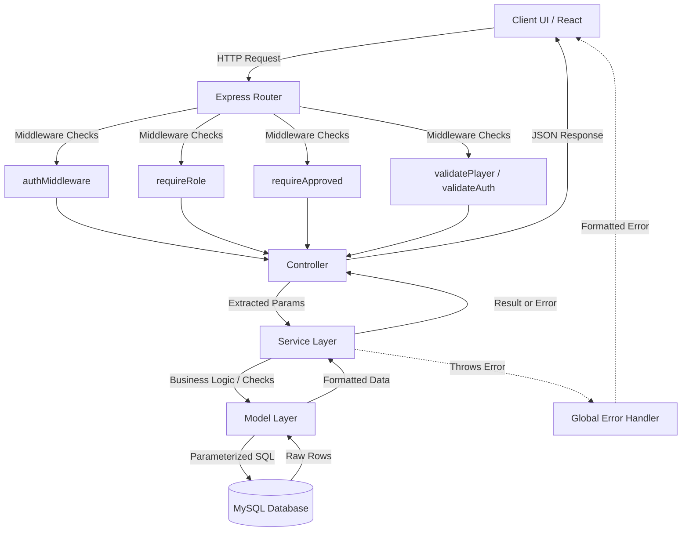

# Project Architecture

## Overview

The VNT Player Management System follows a strict **N-Tier (Layered) Architecture** on the backend and a **Component-Based Architecture** on the frontend. The system cleanly separates HTTP concerns from business logic and database execution, ensuring high maintainability and testability. The application is completely stateless, relying on JSON Web Tokens (JWT) for session management and standard REST principles for client-server communication.

The system currently includes: authentication, JWT-based authorization, player/team CRUD, file uploads (avatar, gallery, documents), background CSV bulk import (Bull queue), Role-Based Access Control (RBAC) with an Organizer approval workflow, location data (countries/states/cities), and an Enrollments DataTable with server-side pagination and multi-filter support.

---

## Layer Responsibilities

### Backend Layers
1. **Routes (`/src/routes`)**: Maps HTTP verbs and endpoints to controller functions. Applies route-level middleware (auth, validation, role checks).
2. **Controllers (`/src/controllers`)**: Entry point for the HTTP request lifecycle. Extracts parameters, delegates to Services, formats JSON responses.
3. **Services (`/src/services`)**: Core business logic, validation rules, and error throwing. Calls the Model layer to persist or retrieve data.
4. **Models (`/src/models`)**: Data access layer. Executes raw parameterized SQL against MySQL. Returns formatted results to Services.
5. **Middleware (`/src/middleware`)**: Intercepts requests before controllers:
   - `authMiddleware` – JWT token verification
   - `requireRole(role)` – Checks `req.user.role` against required role
   - `requireApproved()` – Checks that `approval_status === 1` for organizers
   - `uploadMiddleware` – Multer-based file handling
   - `errorHandler` – Centralized error handler
   - `validatePlayer`, `validateAuth`, `validateTeam` – Schema-level input validation

### Frontend Layers
1. **Pages (`/src/pages`)**: Top-level views orchestrating layouts and URL state.
2. **Hooks (`/src/hooks`)**: Custom React Query hooks managing server state, fetching, caching, and background sync.
3. **Components (`/src/components`)**: Reusable UI elements (forms, tables, dialogs) receiving data via props or internal state.
4. **API Layer (`/src/api`)**: Axios instances and route definitions handling network requests and token injection via interceptors.

---

## Request Lifecycle

1. **Client Initiation**: Frontend triggers an HTTP request via Axios.
2. **Security & Rate Limiting**: Global middleware (`helmet`, `cors`, `rateLimit`) processes it first.
3. **Authentication Check**: `authMiddleware` validates the JWT in the `Authorization` header (protected routes only).
4. **Role Check**: `requireRole()` validates `req.user.role` (role-restricted routes only).
5. **Approval Check**: `requireApproved()` checks `approval_status === 1` (organizer routes only).
6. **Payload Validation**: Route-level middleware verifies the request body structure.
7. **Controller Processing**: Controller extracts validated data and calls the appropriate service method.
8. **Business Logic Execution**: Service processes business rules and throws custom errors on failure.
9. **Database Interaction**: Model executes parameterized SQL and returns raw rows.
10. **Response Formatting**: Controller sends a structured JSON response.
11. **Error Interception**: Global Error Handler intercepts any thrown error and formats a safe JSON response.

---

## RBAC Architecture

### Roles
| Role | Description |
|------|-------------|
| `admin` | Full system access. Can approve/reject organizers. |
| `organizer` | Can manage players/teams. Must be approved by admin first. |
| `user` | Default role. Basic read access. |

### Approval Status
| Value | Meaning |
|-------|---------|
| `0` | Pending – awaiting admin review |
| `1` | Approved – can login and access organizer features |
| `2` | Rejected – cannot login |

### Middleware Chains
```
Organizer routes: Request → authMiddleware → requireRole('organizer') → requireApproved() → Controller
Admin routes:     Request → authMiddleware → requireRole('admin') → Controller
```

---

## Authentication & Authorization Flow

### Login
1. Client submits credentials to `POST /api/auth/login`.
2. `authService` retrieves the user by email.
3. `bcrypt.compare()` verifies the password.
4. If `role === 'organizer'` and `approval_status !== 1`, return 403 `"Account not approved yet"`.
5. If valid, sign and return JWT containing `{ id, role, approval_status }`.

### Organizer Signup
1. Organizer submits form to `POST /api/auth/signup-organizer` (multipart/form-data with documents).
2. `organizerService` saves record with `role='organizer'`, `approval_status=0`, `is_active=0`.
3. Documents stored in `/uploads/organizers/documents/`.
4. Organizer cannot login until admin approves.

### Admin Approval Flow
1. Admin calls `GET /api/admin/organizers?status=pending` to see pending list.
2. Admin calls `PATCH /api/admin/organizers/:id/approve` or `reject`.
3. Approved: `approval_status=1`, `is_active=1`. Rejected: `approval_status=2`, `is_active=0`.

---

## File Upload Flow

### Player Uploads
- **Avatar**: Single image → `/uploads/players/avatar/`
- **Gallery**: Up to 5 images → `/uploads/players/gallery/`
- Constraints: Max 2MB per file, `.jpg`/`.png` only.
- Storage: Relative file path stored in DB.

### Organizer Document Uploads
- **Documents**: Multiple files → `/uploads/organizers/documents/`
- Constraints: `.jpg`, `.png`, `.pdf`; max 5MB per file.
- Storage: Relative file paths stored in `organizers.documents` (JSON column).

---

## Enrollments Module Architecture

### Overview
The Enrollments module is a read-heavy data management feature built around **server-side pagination**, **multi-dimensional filtering**, and a **flag-based TINYINT enum** pattern for `status`, `invite_type`, and `role` columns.

### Database Schema – `enrollments`
```sql
CREATE TABLE enrollments (
  id          INT AUTO_INCREMENT PRIMARY KEY,
  name        VARCHAR(255) NOT NULL,
  phone       VARCHAR(20)  NOT NULL,
  team_id     INT          NOT NULL,
  status      TINYINT      NOT NULL DEFAULT 0,  -- 0=unpaid, 1=paid, 2=free
  invite_type TINYINT      NOT NULL DEFAULT 0,  -- 0=non-invited, 1=invited
  role        TINYINT      NOT NULL,             -- 1=batsman, 2=bowler, 3=wicketkeeper, 4=allrounder
  enrolled_at TIMESTAMP    DEFAULT CURRENT_TIMESTAMP,
  FOREIGN KEY (team_id) REFERENCES teams(id) ON DELETE CASCADE
);
```

### Flag Enum Contract (Backend ↔ Frontend)
| Column      | Value | Label        |
|-------------|-------|--------------|
| status      | 0     | Unpaid       |
| status      | 1     | Paid         |
| status      | 2     | Free         |
| invite_type | 0     | Non-Invited  |
| invite_type | 1     | Invited      |
| role        | 1     | Batsman      |
| role        | 2     | Bowler       |
| role        | 3     | Wicketkeeper |
| role        | 4     | All-rounder  |

### API Contract – `GET /api/enrollments`
**Query Parameters:**
- `page` (default: 1), `limit` (default: 50)
- `search` – partial match on `name` or `phone`
- `status`, `invite_type`, `role` – TINYINT filter values
- `team_id` – FK filter

**Response:**
```json
{
  "success": true,
  "data": [...],
  "pagination": { "page": 1, "limit": 50, "total": 1000, "totalPages": 20 }
}
```

### Dynamic SQL Filter Pattern
```javascript
const conditions = [], params = [];
if (search)                    { conditions.push('(e.name LIKE ? OR e.phone LIKE ?)'); params.push(`%${search}%`, `%${search}%`); }
if (status !== undefined)      { conditions.push('e.status = ?');      params.push(status); }
if (invite_type !== undefined) { conditions.push('e.invite_type = ?'); params.push(invite_type); }
if (role !== undefined)        { conditions.push('e.role = ?');        params.push(role); }
if (team_id)                   { conditions.push('e.team_id = ?');     params.push(team_id); }
const whereClause = conditions.length ? 'WHERE ' + conditions.join(' AND ') : '';
```

### Backend Layer Responsibilities
- **Route** (`enrollmentRoutes.js`): Binds `GET /` to controller. Public route.
- **Controller** (`enrollmentController.js`): Extracts `req.query`, calls service, returns JSON.
- **Service** (`enrollmentService.js`): Sanitizes/validates params, delegates to model.
- **Model** (`enrollmentModel.js`): Builds dynamic WHERE clause, runs `COUNT(*)` then paginated `SELECT ... LEFT JOIN teams`.

### Frontend Layer Responsibilities
- **Page** (`EnrollmentsPage.tsx`): Manages URL search params for all filter states.
- **Hook** (`useEnrollments.ts`): React Query hook syncing URL params to API call; includes CSV export utility.
- **API** (`enrollmentApi.ts`): Axios `GET /api/enrollments` with URLSearchParams.
- **Components**: `EnrollmentsTable.tsx`, `EnrollmentViewDialog.tsx`, `EnrollmentEditDialog.tsx`, `EnrollmentDeleteDialog.tsx`.

### Server-Side Pagination Strategy
- All filter and page state lives in the URL (`?page=1&limit=50&status=1&role=2`).
- React Query key includes all params — any change triggers a fresh fetch.
- `COUNT(*)` + `LIMIT/OFFSET` pattern — never fetches all rows at once.

### Flag-to-Label Resolution (Frontend)
Constants defined in `src/utils/enrollmentFlags.ts` — single source of truth:
```typescript
export const STATUS_LABELS: Record<number, string> = { 0: 'Unpaid', 1: 'Paid', 2: 'Free' };
export const INVITE_LABELS: Record<number, string> = { 0: 'Non-Invited', 1: 'Invited' };
export const ROLE_LABELS:   Record<number, string> = { 1: 'Batsman', 2: 'Bowler', 3: 'Wicketkeeper', 4: 'All-rounder' };
```

---

## Frontend → Backend Flow

The frontend communicates exclusively via RESTful JSON APIs using Axios.
- **Interceptors**: Request interceptor attaches the JWT from `localStorage`. Response interceptor catches `401` and forces logout.
- **Server State**: React Query handles fetching, caching, and background sync.

---

## Backend → Database Flow

- MySQL via `mysql2` connection pool (`config/db.js`). No ORM.
- **Parameterization**: Every dynamic value injected using `?` placeholders.
- **Relational Joins**: `LEFT JOIN` for optional related data (teams, locations).
- **Pagination**: Separate `COUNT(*)` query → then `LIMIT`/`OFFSET`.

---

## Error Handling Flow

1. Controllers wrap execution in `try/catch` and call `next(error)` on failure.
2. Services throw custom `Error` objects with an attached `.status` code.
3. Global Error Handler (`errorHandler.js`) intercepts all errors and formats a safe JSON response.

---

## Dependency Graph

```
[Frontend (React/Vite/TypeScript)]
  ├── React Router (Navigation + Protected Routes)
  ├── React Query (Server State Cache)
  └── Axios (HTTP Client)
       └── Interceptors (Auth Injection / 401 Redirect)

[Backend (Express)]
  ├── Helmet & CORS (Security)
  ├── Express Rate Limit (DDoS Protection)
  ├── jsonwebtoken (Auth + Role Payload)
  ├── bcrypt (Password Hashing)
  ├── multer (File Upload Handling)
  ├── bull + ioredis (Background Job Queue)
  └── mysql2 (Database Pool)
```

---

## Folder Responsibilities

| Path | Responsibility |
|------|---------------|
| `backend/src/config/` | DB pool, Redis connection |
| `backend/src/controllers/` | HTTP request/response orchestration |
| `backend/src/middleware/` | Auth, Role, Approval, Upload, Validation, Error Handling |
| `backend/src/models/` | Parameterized SQL execution |
| `backend/src/routes/` | Endpoint definitions and middleware binding |
| `backend/src/services/` | Business logic and rule enforcement |
| `backend/src/queues/` | Bull queue definitions |
| `backend/src/workers/` | Background job processors |
| `backend/src/utils/` | Helper utilities |
| `frontend/src/api/` | Network request definitions and Axios config |
| `frontend/src/components/` | Reusable UI elements |
| `frontend/src/hooks/` | Data fetching and state logic |
| `frontend/src/pages/` | View orchestration and URL syncing |
| `frontend/src/utils/` | Pure helper functions and flag constants |

---

## Module Interaction Diagram



---

## Architectural Observations

### Design Patterns
1. **Dependency Injection (Light)**: Connection pools and request objects passed downwards.
2. **Singleton**: `mysql2` connection pool acts as a singleton.
3. **Decorator (Middleware)**: Express middleware dynamically adds auth, validation, and role enforcement to routes.
4. **Strategy Pattern**: `requireRole()` accepts a role string — reusable for any role-based check.

### Strengths
- **Separation of Concerns**: HTTP logic entirely decoupled from business logic.
- **Statelessness**: JWT usage ensures no session memory consumed.
- **Security**: Centralized error handling, parameterized queries, role middleware.
- **Extensibility**: RBAC middleware composable freely without coupling.

### Known Weaknesses
- **No Refresh Tokens**: JWTs are long-lived with no rotation mechanism.
- **No DTOs**: Service layer receives raw `req.body` objects.
- **Model Bloat Risk**: Dynamic SQL generation complexity grows with more filters.
- **No Test Architecture**: No unit or integration testing infrastructure.

### Future Refactoring Opportunities
1. **Schema Validation**: Adopt `Joi` or `Zod` for request body validation.
2. **Query Builder**: Use `Knex.js` to manage dynamic WHERE clauses cleanly.
3. **Refresh Tokens**: Add JWT refresh token rotation.
4. **TypeScript (Backend)**: Migrate backend to TypeScript for interface enforcement.
